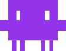

<p>
  
  <span style="font-size: 2rem; font-weight: 700; margin-left: 14px; vertical-align: middle;">Shlomo Code</span>
</p>

Shlomo Code brings the Claude Code-style terminal UI to a fully local workflow. It is wired to use LM Studio on `localhost` by default, exposes local model selection in the TUI, and removes the need for Anthropic auth setup in normal use.

## How It Works

Shlomo is baked to talk to LM Studio locally.

- Built-in local endpoint: `http://localhost:1234/v1`
- Built-in local auth token: `lmstudio`
- No shell environment setup is required for normal use
- The only setting you typically need to change is the LM Studio port
- When you switch models with `/model`, Shlomo unloads other loaded LM Studio LLMs before loading the selected one
- You can unload all currently loaded LM Studio models with `/unload`
- You can also unload models directly from the shell with `shlomo unload`
- You can resume sessions directly from the shell with `shlomo resume`

If LM Studio is running on a different port, change it inside the app:

```text
/port 1235
```

You can also check or reset it:

```text
/port status
/port reset
```

## Quick Start

### 1. Install prerequisites

- [Bun](https://bun.sh/)
- Node.js
- [LM Studio](https://lmstudio.ai/)

### 2. Start LM Studio

In LM Studio:

1. Load a chat-capable model
2. Start the local server
3. Leave it on port `1234` unless you plan to change it with `/port`

### 3. Install dependencies

```bash
bun install
```

### 4. Build Shlomo

```bash
bun run build
```

This produces:

```bash
dist/shlomo
```

### 5. Run it

```bash
./dist/shlomo
```

## Run On Your Device

If you want `shlomo` available globally on your machine:

```bash
sudo ln -s /absolute/path/to/this/repo/dist/shlomo /usr/local/bin/shlomo
hash -r
```

Then run:

```bash
shlomo
```

This assumes:

- LM Studio is installed on that device
- LM Studio's local server is running
- A chat model is loaded

Why symlink instead of copying:

- `shlomo` always points at the latest local build
- after `bun run build`, you do not need to reinstall it
- it avoids stale copies in `/usr/local/bin`

## Common Commands

Start the full TUI:

```bash
./dist/shlomo
```

Show help:

```bash
./dist/shlomo --help
```

Run a one-shot prompt:

```bash
./dist/shlomo -p "explain this repository"
```

Unload all currently loaded LM Studio models from memory:

```text
/unload
```

Unload all currently loaded LM Studio models without opening the TUI:

```bash
shlomo unload
```

Open the session resume flow directly from the shell:

```bash
shlomo resume
```

Resume a specific session from the shell:

```bash
shlomo resume <session-id-or-search>
```

Build the JavaScript bundle instead of the native Bun binary:

```bash
bun run build:js
```

Run the bundled JS build:

```bash
bun ./dist/shlomo.js
```

## Repo Layout

| Path | Purpose |
| --- | --- |
| `src/` | Reconstructed full TUI and CLI |
| `scripts/build-tui.ts` | TUI build script |
| `dist/shlomo` | Compiled binary output |

## Current Scope

Implemented:

- Claude Code-style terminal interface
- LM Studio-backed local completions
- Local model listing from `/v1/models`
- Filtering out embedding-only models from the picker
- Baked-in localhost configuration

Reduced or intentionally omitted:

- Anthropic account login flows
- Claude.ai web/session features
- Cloud billing and subscription behavior
- Updater/install flows from the upstream product
- Features that rely on APIs local LM Studio models do not support

## What Changed

- The CLI and visible branding were changed from Claude Code to Shlomo Code
- The default runtime is now LM Studio on localhost, not Anthropic-hosted services
- Model discovery comes from your local LM Studio server
- Embedding-only models are filtered out of the interactive model list
- Switching models now unloads other loaded LM Studio LLMs before loading the selected model
- The LM Studio port can be changed in-app with `/port`
- `/unload` unloads all currently loaded LM Studio models
- `shlomo unload` unloads models without entering the TUI
- `shlomo resume` exposes the same resume flow directly from the shell

## Troubleshooting

If Shlomo starts but does not answer:

- Make sure LM Studio is running
- Make sure a chat model is loaded, not only an embedding model
- Confirm LM Studio is serving on the expected port
- If needed, change the port inside Shlomo with `/port`

If the binary does not run on another machine:

- Rebuild it on that machine with `bun install` and `bun run build`

If you want to verify the local backend quickly:

```bash
./dist/shlomo -p "hello"
```

## Notes

This repo is not a pristine upstream Claude Code checkout. It is a modified local fork focused on a practical LM Studio-backed experience. The full TUI is present and runnable, but the project is intentionally narrower than the original product surface.
